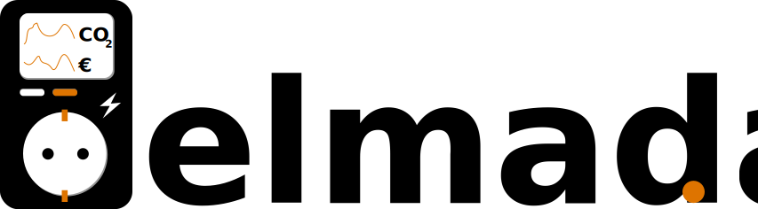
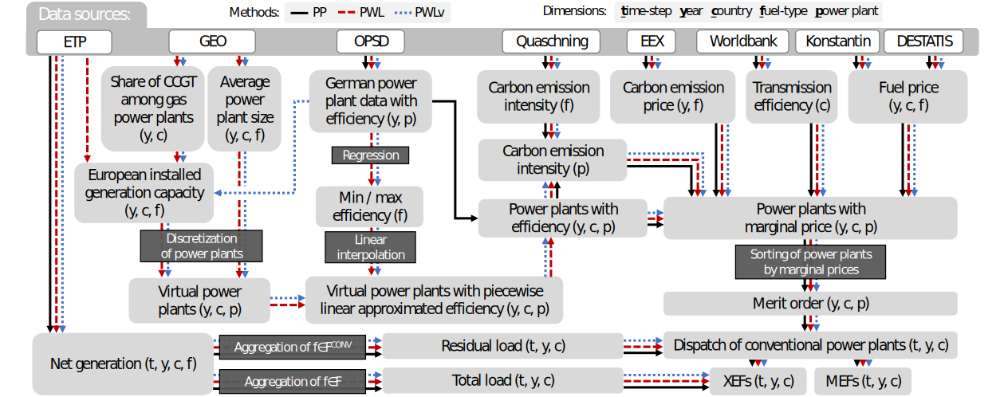
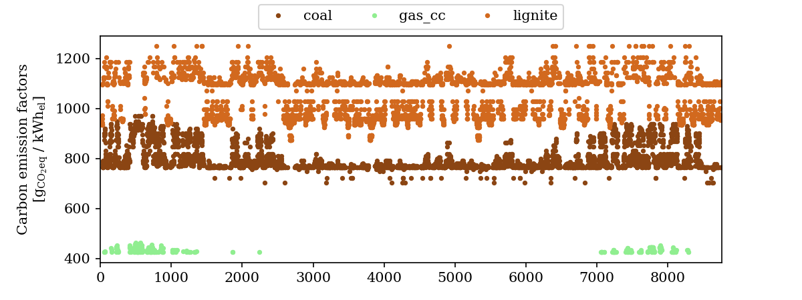
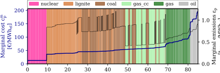

---

# Elmada: electricity market data for energy system modeling

<!-- [](https://github.com/DrafProject/elmada/actions/workflows/On_push.yml)
[](https://codecov.io/gh/DrafProject/elmada) -->
[](https://gitter.im/DrafProject/elmada)
[](https://www.gnu.org/licenses/lgpl-3.0)
[](https://github.com/psf/black)
[](https://pycqa.github.io/isort/)
[](CODE_OF_CONDUCT.md)

Elmada stands for **el**ectricity **ma**rket **da**ta and essentially provides carbon emission factors as well as wholesale prices for energy system models that focus on the demand side, e.g., demand response potential analyses.
Elmada is part of the [Draf Project] (Demand Response Analysis Framework) but can be used as a standalone package.


## Features

* __Carbon emission factors__ are calculated depending on country and year in up to quarter-hourly resolution.
You can choose between
  * grid mix emission factors (XEFs) from fuel type-specific [ENTSO-E] electricity generation data (`method="XEF_EP"`)
  * and approximations using merit order based simulations which allow also for the calculation of marginal emission factors (MEFs).
    The according Power Plant method (`PP`) and Piecewise Linear method (`PWL`) are described in [this open-access paper][paper].
    The data used depends on the method chosen, see [scheme below](#cef-scheme).

* __Electrcity prices__ are provided for European national electricity grids. You can choose between the real historical [ENTSO-E] data or the simulation results of PP/PWL method.

* Other interesting market data such as the merit order list, fuel-specific generation data, and power plant lists are provided as a by-product of the CEF calculations.

## Methodology

This scheme from the [paper] shows an overview of the methods PP, PWL, and PWLv:
 <!-- Converted from pptx via https://convertio.co/ -->
 

# Data

## Data modes

You can use Elmada in two data modes which can be set with `elmada.set_mode(mode=<MODE>)`:

* `mode="safe"` (default):
  * Pre-cached data for 4 years and 20 countries are used. The data are described in the [paper].
  * The years are 2017 to 2020 and the countries AT, BE, CZ, DE, DK, ES, FI, FR, GB, GR, HU, IE, IT, LT, NL, PL, PT, RO, RS, SI.
  * The data is available in the space-saving and quick-to-read [Parquet format] under [.../safe_cache].
* `mode="live"`:
  * Up-to-date data are retrieved on demand and are cached to an OS-specific directory, see `elmada.paths.CACHE_DIR`. A symbolic link to it can be conveniently created by executing `elmada.make_symlink_to_cache()`.
  * Available years are 2017 until the present.
  * Slow due to API requests.
  * Requires valid API keys of Entsoe, Morph, Quandl, see [table below](#data-table).

## Data sources

| Description | Local data location | Source | Channel | Involed in |
|-|-|-|-|-|
| Generation time series & installed generation capacities | [.../safe_cache] or `CACHE_DIR` | [ENTSO-E] | 🔌 on-demand-retrieval via [EntsoePandasClient] (requires valid [ENTSO-E API key] in [.../api_keys]`/entsoe.txt`) | CEFs via `EP`, `PP`, `PWL`, `PWLv` |
| Carbon prices (EUA)| [.../safe_cache] or `CACHE_DIR` | [Sandbag] & [ICE] | 🔌 on-demand-retrieval via [Quandl] (requires valid [Quandl API key] in [.../api_keys]`/quandl.txt`) | CEFs via `_PP`, `PWL`, `PWLv` |
| Share of CCGT among gas power plants | [.../safe_cache] or `CACHE_DIR` | [GEO] | 🔌 on-demand-download via [Morph] (requires valid [Morph API key] in [.../api_keys]`/morph.txt`)| CEFs via `PWL`, `PWLv` |
| (Average) fossil power plants sizes | [.../safe_cache] or `CACHE_DIR` | [GEO] | 🔌 on-demand-scraping via [BeautifulSoup4] | CEFs via `PWL`, `PWLv` |
| German fossil power plant list with efficiencies | [.../safe_cache] or `CACHE_DIR` | [OPSD] | 🔌 on-demand-download from [here][opsd_download] | CEFs via `PP`, `PWL`, `PWLv` |
| Transmission & distribution losses | [.../worldbank] | [Worldbank] | 💾 manual download from [here][wb] | CEFs via `_PP`, `PWL`, `PWLv` |
| Fuel prices for 2015 (+ trends) | [.../from_other.py] (+ [.../destatis]) | [Konstantin.2017] (+ [DESTATIS]) | 🔢 hard-coded values (+ 💾 manual download from [here][destatis_download]) | CEFs via `PP`, `PWL`, `PWLv` |
| Fuel type-specific carbon emission intensities | [.../from_other.py] & [.../tranberg] | [Quaschning] & [Tranberg.2019] | 🔢 hard-coded values | CEFs via `EP`, `PP`, `PWL`, `PWLv` |

# Installation

## Using conda / pip

Conda install (preferred):

```sh
... coming soon
```

Install with `pip` (PyPI registration is coming soon):

```sh
python -m pip install git+https://github.com/DrafProject/elmada.git
```

## From source (including environment and editable version)

Clone the source repository:

```sh
git clone https://github.com/DrafProject/elmada.git
cd elmada
```

Create environment based on environment.yml and install an editable local Elmada version:

```sh
conda env create
```

Activate environment

```sh
conda activate elmada
```

Run the tests and ensure that there are no errors

```sh
pytest
```

# Usage

```py
import elmada

# OPTIONAL: Set your api keys and go live mode:
elmada.set_api_keys(entsoe=<YOUR_ENTSOE_KEY>, morph=<YOUR_MORPH_KEY, quandl=<YOUR_QUANDL_KEY>)
elmada.set_mode("live")
```

## Carbon Emission factors

### Get only CEFs

```py
elmada.get_emissions(year=2019, country="DE", method="MEF_PWL", freq="60min", use_datetime=True)
```

... returns marginal emission factors with hourly datetime index:

```sh
2019-01-01 00:00:00     990.103492
2019-01-01 01:00:00     959.758367
                          ...
2019-12-31 22:00:00    1064.122146
2019-12-31 23:00:00    1049.852079
Freq: 60T, Name: MEFs, Length: 8760, dtype: float64
```

The `method` argument of `get_emissions()` takes strings that consists of two parts seperated by an underscore.
The first part is the type of emission factor: grid mix emission factors (`XEF`) or marginal emission factors (`MEF`).
The second part determines the calculation method: power plant method (`PP`), piecewise linear method (`PWL`),  or piecewise linear method in validation mode (`PWLv`).
The first part can be omitted (`_PP`, `_PWL`, `_PWLv`) to return a DataFrame that includes additional information.
Additionally, XEFs can be calculated from historic fuel type-specific generation data (`XEF_EP`).

Here is an overview of valid `method` argument values:

| `method` | Return type | Return values | Restriction |
| --: | -- | -- | -- |
| `XEF_PP` | Series | XEFs using PP method | DE |
| `XEF_PWL` | Series | XEFs using PWL method | European countries |
| `XEF_PWLv` | Series | XEFs using PWLv method | DE |
| `MEF_PP` | Series | MEFs from PP method | DE |
| `MEF_PWL` | Series | MEFs using PWL method | European countries |
| `MEF_PWLv` | Series | MEFs using PWLv method | DE |
| `_PP` | Dataframe | extended data for PP method | DE |
| `_PWL` | Dataframe | extended data for PWL method | European countries |
| `_PWLv` | Dataframe | extended data for PWLv method | DE |
| `XEF_EP` | Series | XEFs using fuel type-specific generation data from [ENTSO-E]| European countries |

### Get additional information

```py
elmada.get_emissions(year=2019, country="DE", method="_PWL")
```

... returns all output from the PWL method:

```sh
      residual_load  total_load marginal_fuel  efficiency  marginal_cost         MEFs        XEFs
0          21115.00    51609.75       lignite    0.378432      40.889230   990.103492  204.730151
1          18919.50    51154.50       lignite    0.390397      39.636039   959.758367  164.716687
...             ...         ...           ...         ...            ...          ...         ...
8758       27116.00    41652.00       lignite    0.352109      43.946047  1064.122146  388.542911
8759       25437.75    39262.75       lignite    0.356895      43.356723  1049.852079  376.009477
[8760 rows x 7 columns]
```

### Plot CEFs

```py
elmada.plots.cefs_scatter(year=2019, country="DE", method="MEF_PP")
```

... plots carbon emission factors:



## Wholesale prices

```py
elmada.get_prices(year=2019, country="DE", method="hist_EP")
```

```sh
0       28.32
1       10.07
        ...  
8758    38.88
8759    37.39
Length: 8760, dtype: float64
```

Possible values for the `method` argument of `get_prices()` are:

| `method` | Description | Restriction |
| --: | -- | -- |
| `PP` | Using the power plant method | DE |
| `PWL` | Using piecewise linear method | European countries |
| `PWLv` | Using piecewise linear method in validation mode | DE |
| `hist_EP` | Using historic [ENTSO-E] data | European countries |
| `hist_SM` | Using historic [Smard] data | used only as backup for DE, 2015 and 2018 |

## Merit order

```py
elmada.plots.merit_order(year=2019, country="DE", method="PP")
```



# Contributing

Contributions in any form are welcome! To contribute changes, please have a look at our [contributing guidelines](CONTRIBUTING.md).

In short:

1. Fork the project and create a feature branch to work on in your fork (`git checkout -b new-feature`).
1. Commit your changes to the feature branch and push the branch to GitHub (`git push origin my-new-feature`).
1. On GitHub, create a new pull request from the feature branch.

# Citing Elmada

If you use Elmada for academic work please cite [this open-access paper][paper] published in Applied Energy in 2021.

# License

Copyright (c) 2021 Markus Fleschutz

[](https://www.gnu.org/licenses/lgpl-3.0)

THE SOFTWARE IS PROVIDED "AS IS", WITHOUT WARRANTY OF ANY KIND, EXPRESS OR IMPLIED, INCLUDING BUT NOT LIMITED TO THE WARRANTIES OF MERCHANTABILITY, FITNESS FOR A PARTICULAR PURPOSE AND NONINFRINGEMENT. IN NO EVENT SHALL THE AUTHORS OR COPYRIGHT HOLDERS BE LIABLE FOR ANY CLAIM, DAMAGES OR OTHER LIABILITY, WHETHER IN AN ACTION OF CONTRACT, TORT OR OTHERWISE, ARISING FROM, OUT OF OR IN CONNECTION WITH THE SOFTWARE OR THE USE OR OTHER DEALINGS IN THE SOFTWARE.

<!-- SOURCES -->
[.../api_keys]: elmada/api_keys
[.../destatis]: elmada/data/raw/destatis
[.../from_other.py]: elmada/from_other.py
[.../safe_cache]: elmada/data/safe_cache
[.../tranberg]: elmada/data/raw/tranberg
[.../worldbank]: elmada/data/raw/worldbank
[BeautifulSoup4]: https://pypi.org/project/beautifulsoup4
[destatis_download]: https://www.destatis.de/DE/Themen/Wirtschaft/Preise/Publikationen/Energiepreise/energiepreisentwicklung-xlsx-5619001.xlsx?__blob=publicationFile
[DESTATIS]: https://www.destatis.de
[Draf Project]: https://github.com/DrafProject
[ENTSO-E API key]: https://transparency.entsoe.eu/content/static_content/Static%20content/web%20api/Guide.html
[ENTSO-E]: https://transparency.entsoe.eu/
[EntsoePandasClient]: https://github.com/EnergieID/entsoe-py#EntsoePandasClient
[GEO]: http://globalenergyobservatory.org
[ICE]: https://www.theice.com
[Konstantin.2017]: https://doi.org/10.1007/978-3-662-49823-1
[Morph API key]: https://morph.io/documentation/api
[Morph]: https://morph.io
[opsd_download]: https://data.open-power-system-data.org/conventional_power_plants/latest
[OPSD]: https://open-power-system-data.org
[paper]: https://doi.org/10.1016/j.apenergy.2021.117040
[Parquet format]: https://parquet.apache.org
[Quandl API key]: https://docs.quandl.com/docs#section-authentication
[Quandl]: https://www.quandl.com
[Quaschning]: https://www.volker-quaschning.de/datserv/CO2-spez/index_e.ph
[Sandbag]: https://sandbag.org.uk/carbon-price-viewer
[Smard]: https://www.smard.de/en
[Tranberg.2019]: https://doi.org/10.1016/j.esr.2019.100367
[wb]: https://databank.worldbank.org/reports.aspx?source=2&series=EG.ELC.LOSS.ZS
[Worldbank]: https://databank.worldbank.org/reports.aspx?source=2&series=EG.ELC.LOSS.ZS
