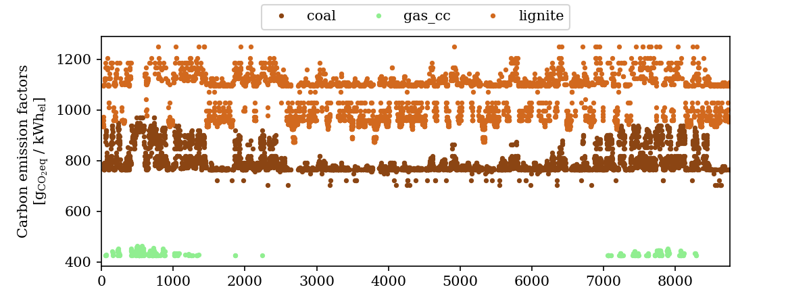
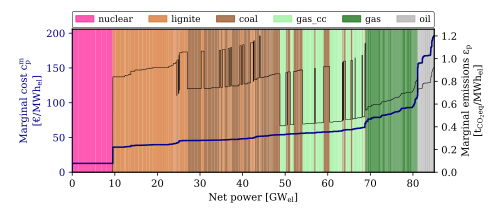

-----------------

# Elmada: electricity market data for energy system modeling

[](https://www.gnu.org/licenses/lgpl-3.0)
[](https://github.com/psf/black)
[](code_of_conduct.md)

Elmada stands for **el**ectricity **ma**rket **da**ta and essentially provides carbon emission factors as well as wholesale prices for energy system models that focus on the demand side, e.g., demand response potential analyses.
Elmada is part of the [Draf Project](https://github.com/DrafProject) (Demand Response Analysis Framework) but can be used as a standalone package.

* __Carbon emission factors__ are calculated depending on country and year in up to quarter-hourly resolution.
The methodology is described in [this open-access paper](https://doi.org/10.1016/j.apenergy.2021.117040) and comprises the calculation of grid mix emission factors (XEFs) and marginal emission factors (MEFs).
The underlying data used depends on the chosen method, see table below.
In any case, however, historical electricity production data from [ENTSO-E](https://transparency.entsoe.eu/) are used.

* __Electrcity prices__ are provided for European national electricity grids -- either real historical [ENTSO-E](https://transparency.entsoe.eu/) data or the simulation results of PP/PWL method.

Other possibly useful market data such as merit order lists, fuel-specific generation data, and national loads power plant lists are provided as a by-product of the CEF calculations.

# Installation

## Using conda/pip

Conda install (preferred):

```bash
... coming soon
```

install with `pip` (PyPI registration is coming soon):

```bash
python -m pip install git+https://github.com/DrafProject/elmada.git
```

## From source

With the following steps, set up a Conda environment with an editable version of Elmada.

Clone the source repository:

```bash
git clone https://github.com/DrafProject/elmada.git
cd elmada
```

Create environment based on environment.yml and install an editable local Elmada version:

```bash
conda env create
```

Activate environment

```bash
conda activate elmada
```

Run the tests and ensure that there are no errors

```bash
pytest
```

# Usage

```sh
>>> import elmada
```

## Carbon Emission factors

```sh
# Return marginal emission factors with hourly datetime index:
>>> elmada.get_emissions(year=2019, country="DE", method="MEF_PWL", freq="60min", use_datetime=True)

2019-01-01 00:00:00     990.103492
2019-01-01 01:00:00     959.758367
                          ...
2019-12-31 22:00:00    1064.122146
2019-12-31 23:00:00    1049.852079
Freq: 60T, Name: MEFs, Length: 8760, dtype: float64
```

`method` is a method string that consists of two parts joined by an underscore. The first part is the type of emission factor.
Use `XEF` for grid mix emission factors and `MEF` for marginal emission factors.
The second part determines the calculation method.
`PP` stands for power plant method, `PWL` for piecewise linear method,  and `PWLv` for the piecewise linear method in validation mode.
Additionally with `XEF_EP` XEFs are calculated from historic fuel type-specific generation data.

Possible values for the `method` argument of `get_emissions()` are:

| `method` | Return type | Return values | Restriction
| --: | -- | -- | -- |
| `XEF_EP` | Series | XEFs using ENTSO-E data | DE |
| `XEF_PP` | Series | XEFs using PP method | DE |
| `XEF_PWL` | Series | XEFs using PWL method | European countries |
| `XEF_PWLv` | Series | XEFs using PWLv method | European countries |
| `MEF_PP` | Series | MEFs from PP method | DE |
| `MEF_PWL` | Series | MEFs using PWL method | European countries |
| `MEF_PWLv` | Series | MEFs using PWLv method | European countries |
| `_PP` | Dataframe | extended data for PP method | DE |
| `_PWL` | Dataframe | extended data for PWL method | European countries |
| `_PWLv` | Dataframe | extended data for PWLv method | European countries |

For PP, PWL, and PWLv, the first part can be omitted (`_PP`, `_PWL`, `_PWLv`) to return a DataFrame that includes additional information:

```sh
# Return all output from the PWL method:
>>> elmada.get_emissions(year=2019, country="DE", method="_PWL")

      residual_load  total_load marginal_fuel  efficiency  marginal_cost         MEFs        XEFs
0          21115.00    51609.75       lignite    0.378432      40.889230   990.103492  204.730151
1          18919.50    51154.50       lignite    0.390397      39.636039   959.758367  164.716687
...             ...         ...           ...         ...            ...          ...         ...
8758       27116.00    41652.00       lignite    0.352109      43.946047  1064.122146  388.542911
8759       25437.75    39262.75       lignite    0.356895      43.356723  1049.852079  376.009477
[8760 rows x 7 columns]
```

### Plot carbon emission factors

```sh
>>> elmada.plots.cefs_scatter(year=2019, country="DE", method="MEF_PP")
```



## Wholesale prices

```sh
>>> elmada.get_prices(year=2019, country="DE", method="hist_EP")

0       28.32
1       10.07
        ...  
8758    38.88
8759    37.39
Length: 8760, dtype: float64
```

Possible values for the `method` argument of `get_prices()` are:

| `method` | Description |
| --: | -- |
| `PP` | Using the power plant (PP) method |
| `PWL` | Using piecewise linear method (PWL) method |
| `PWLv` | Using piecewise linear method in validation mode |
| `hist_EP` | Using historic ENTSO-E data |
| `hist_SM` | Using historic Smard data (used only as backup for DE, 2015 and 2018) |

## Merit order

```sh
>>> fig, ax, ax_right = elmada.plots.merit_order(year=2019, country="DE", method="PP")
```



# Data

You can use Elmada in two modes which can be set with `elmada.set_mode(mode=<MODE>)`:

* `mode="safe"` (default):
  * Pre-cached data for 4 years and 20 countries are used. The data are described in the [paper](https://doi.org/10.1016/j.apenergy.2021.117040).
  * The years are 2017 to 2020 and the countries AT, BE, CZ, DE, DK, ES, FI, FR, GB, GR, HU, IE, IT, LT, NL, PL, PT, RO, RS, SI.
  * The data is available in the space-saving and quick-to-read [Parquet format](https://parquet.apache.org/) under [data/safe_cache](elmada/data/safe_cache).
* `mode="live"`:
  * Up-to-date data are retrieved on demand and are cached to an OS-specific directory, see `elmada.paths.CACHE_DIR`. A symbolic link to it can be conveniently created by executing `elmada.helper.make_symlink_to_cache()`.
  * Available years are 2017 until the present.
  * Slow due to API requests.
  * Requires valid API keys of Entsoe, Morph, Quandl, see table below.

| Description | Local data location | Source | Channel |
|-|-|-|-|
| Generation time series & installed generation capacities | <temp_dir> | [ENTSO-E](https://transparency.entsoe.eu/) | 🔌 on-demand-retrieval via [EntsoePandasClient](https://github.com/EnergieID/entsoe-py#EntsoePandasClient) (requires valid [ENTSO-E API key](https://transparency.entsoe.eu/content/static_content/Static%20content/web%20api/Guide.html) in [elmada/api_keys](elmada/api_keys)`/entsoe.txt`) |
| Share of CCGT among gas power plants | <temp_dir> | [GEO](http://globalenergyobservatory.org/) | 🔌 on-demand-download via [Morph](https://morph.io/) (requires valid [Morph API key](https://morph.io/documentation/api) in [elmada/api_keys](elmada/api_keys)`/morph.txt`)|
| Carbon prices (EUA)| <temp_dir> | [Sandbag](https://sandbag.org.uk/carbon-price-viewer/) / [ICE](https://www.theice.com/)| 🔌 on-demand-retrieval via [Quandl](https://www.quandl.com/) (requires valid [Quandl API key](https://docs.quandl.com/docs#section-authentication) in [elmada/api_keys](elmada/api_keys)`/quandl.txt`) |
| (Average) fossil power plants sizes | <temp_dir> | [GEO](http://globalenergyobservatory.org/) | 🔌 on-demand-scraping via [BeautifulSoup4](https://pypi.org/project/beautifulsoup4/) |
| German fossil power plant list with efficiencies | <temp_dir> | [OPSD](https://open-power-system-data.org/)  | 🔌 on-demand-download from [here](https://data.open-power-system-data.org/conventional_power_plants/latest/) |
| Transmission & distribution losses | [.../worldbank](elmada/data/raw/worldbank) | [Worldbank](https://databank.worldbank.org/reports.aspx?source=2&series=EG.ELC.LOSS.ZS) | 💾 manual download from [here](https://databank.worldbank.org/reports.aspx?source=2&series=EG.ELC.LOSS.ZS)  |
| Fuel price trends | [.../destatis](elmada/data/raw/destatis) | [DESTATIS](https://www.destatis.de/) | 💾 manual download from [here](https://www.destatis.de/DE/Themen/Wirtschaft/Preise/Publikationen/Energiepreise/energiepreisentwicklung-xlsx-5619001.xlsx?__blob=publicationFile) |
| Fuel prices for 2015 | in code | [Konstantin.2017](https://doi.org/10.1007/978-3-662-49823-1) | 🔢 hard-coded values |
| Carbon emission intensities | in code ([.../tranberg](elmada/data/raw/tranberg)) | [Quaschning](https://www.volker-quaschning.de/datserv/CO2-spez/index_e.ph) ([Tranberg.2019](https://doi.org/10.1016/j.esr.2019.100367)) | 🔢 hard-coded values |

# Contributing

Contributions in any form are welcome! To contribute changes, please have a look at our [contributing guidelines](CONTRIBUTING.md).

In short:
1. Fork the project and create a feature branch to work on in your fork (`git checkout -b new-feature`).
1. Commit your changes to the feature branch and push the branch to GitHub (`git push origin my-new-feature`).
1. On GitHub, create a new pull request from the feature branch.

# Citing Elmada

If you use Elmada for academic work please cite [this open-access paper](https://doi.org/10.1016/j.apenergy.2021.117040) published in Applied Energy in 2021.

# License

Copyright (c) 2021 Markus Fleschutz

[](https://www.gnu.org/licenses/lgpl-3.0)

THE SOFTWARE IS PROVIDED "AS IS", WITHOUT WARRANTY OF ANY KIND, EXPRESS OR IMPLIED, INCLUDING BUT NOT LIMITED TO THE WARRANTIES OF MERCHANTABILITY, FITNESS FOR A PARTICULAR PURPOSE AND NONINFRINGEMENT. IN NO EVENT SHALL THE AUTHORS OR COPYRIGHT HOLDERS BE LIABLE FOR ANY CLAIM, DAMAGES OR OTHER LIABILITY, WHETHER IN AN ACTION OF CONTRACT, TORT OR OTHERWISE, ARISING FROM, OUT OF OR IN CONNECTION WITH THE SOFTWARE OR THE USE OR OTHER DEALINGS IN THE SOFTWARE.
